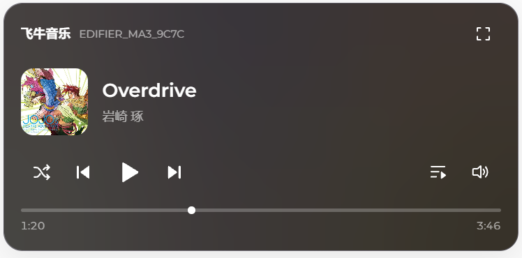
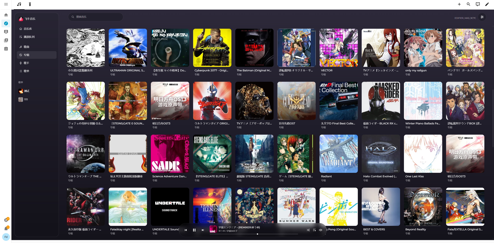
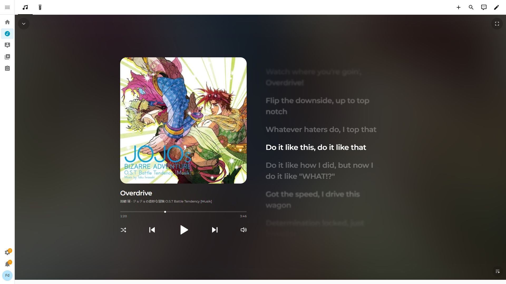
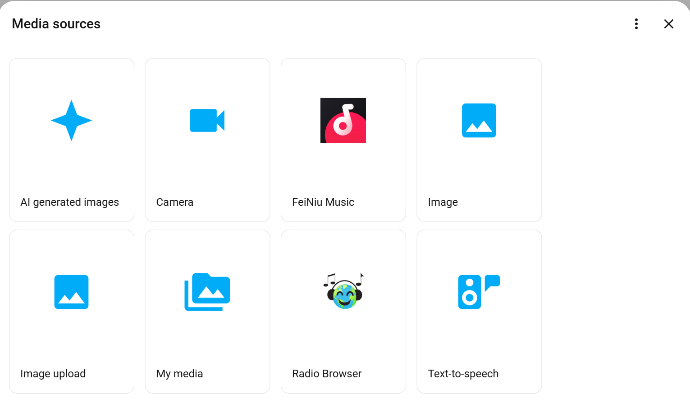
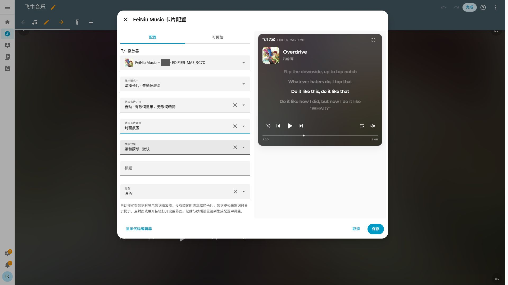
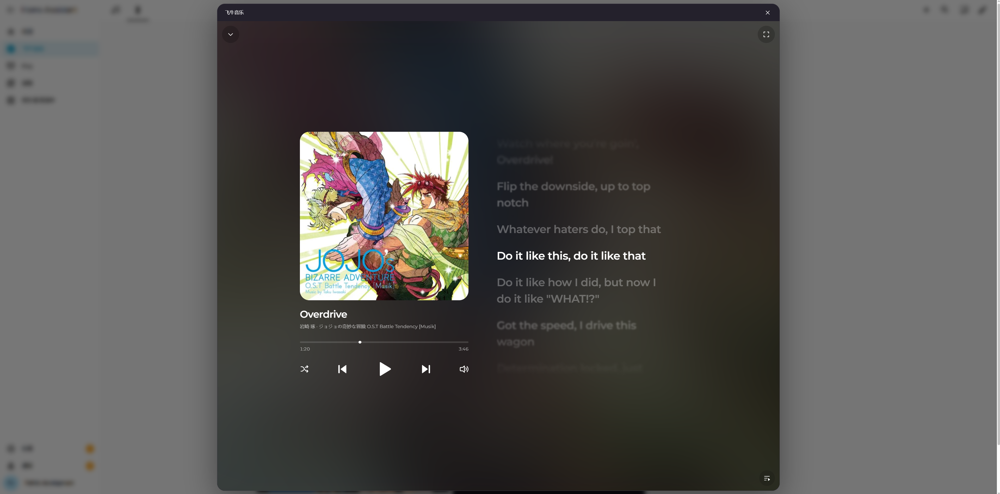
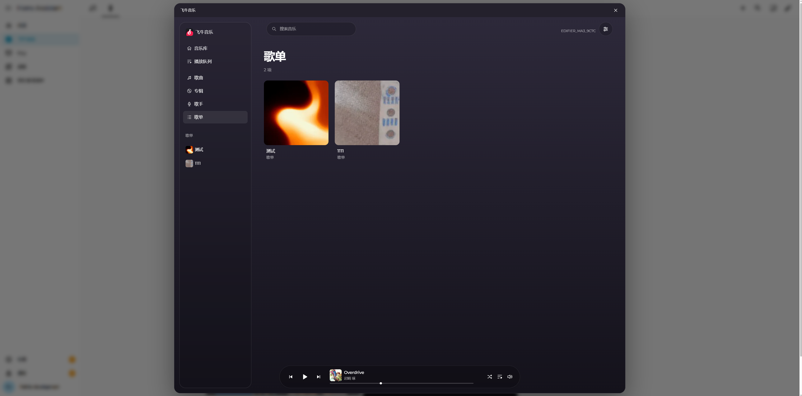
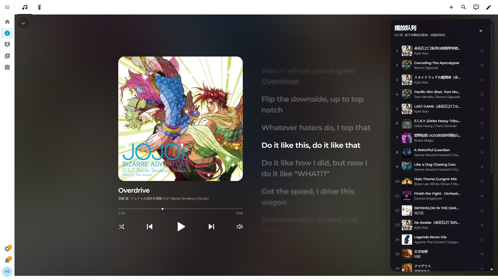

# 飞牛音乐 · Home Assistant

在 Home Assistant 中浏览飞牛音乐曲库，**通过已经接入 HA 的音箱播放音乐**。模仿飞牛音乐网页的风格制作。

既可以作为仪表盘上的紧凑卡片，也可以在 HA 中单独做成一个完整的音乐页面。支持电脑横屏、手机和平板竖屏，歌曲播放页还可以进入全屏。

集成同时提供 HA 原生媒体源（`media_source`），不使用卡片也能浏览曲库、选择音乐并用于自动化。每台飞牛播放器都有独立队列，可以分别播放不同的音乐。

使用普通飞牛音乐账号连接，**支持同时接入多个飞牛音乐账号**。本项目为非官方集成，不修改 NAS 上的曲库和歌单。

## 紧凑音乐卡片

日常控制可以用精简播放器。



<p align="center"><sub>精简播放器：适合放在日常仪表盘上的紧凑卡片。</sub></p>

## 独立音乐页面、横竖屏与全屏

选择**完整界面**，搭配 HA 的面板视图，就能在浏览器中把它作为一个独立的音乐网页使用：左侧浏览歌曲、专辑、歌手和歌单，底部保留播放器。



<p align="center"><sub>完整音乐页面：独占一个 HA 面板视图，在浏览器中浏览曲库和控制播放。</sub></p>

打开歌曲播放页，可以一边听歌一边看歌词，背景会随封面变化。**横屏**时封面与歌词左右排列；**竖屏**时自动切换为上下布局，适合手机和竖放的平板。

在支持全屏的浏览器中，点击歌曲播放页右上角的**全屏按钮**，即可让播放界面铺满屏幕。完整音乐页面和从卡片展开的播放弹窗都支持这一操作。



<p align="center"><sub>完整界面的横屏歌曲播放页：封面与歌词左右排列，右上角可进入全屏。</sub></p>

## 安装

请使用 **Home Assistant 2025.12.2 或更新版本**，并先将音箱接入 HA。

### 通过 HACS 安装

1. 在 HACS 中添加自定义仓库：`https://github.com/neqq3/ha-feiniu-music`，类型选择 **Integration**。
2. 搜索并下载 **FeiNiu Music**，然后重启 Home Assistant。

### 手动安装

将本仓库的 `custom_components/feiniu_music` 文件夹复制到 HA 配置目录下的 `custom_components` 中，然后重启 HA。

## 连接飞牛音乐

1. 打开 **设置 → 设备与服务 → 添加集成**，搜索 **FeiNiu Music**。
2. 建议直接复制浏览器中飞牛音乐页面的完整地址，例如 `http://test:5666/music/`（将 `test` 换成你的 NAS 地址），再填写音乐账号的用户名和密码。**请保留实际端口号**；默认安装通常使用 5666，自定义端口和 HTTPS 反向代理也可以，服务根地址同样支持。
3. 选择要使用的音箱。以后也可以在集成配置中增删。

配置完成后，每台选中的音箱会对应一个飞牛播放器实体。打开它的“浏览媒体”，即可按歌曲、专辑、歌手或歌单选曲。

需要接入其他账号时，再次添加 **FeiNiu Music** 集成并登录另一个账号即可，多个账号可以同时保留和使用。

要使用播放队列，请操作这个**飞牛播放器实体**。直接通过原始音箱实体浏览飞牛媒体源时，只会播放所选单曲。

## HA 原生媒体源（media_source）

集成也会在 HA 的 **媒体（Media sources）** 中提供 **FeiNiu Music** 入口。选择账号后，可以按歌曲、专辑、歌手和歌单浏览曲库。原生媒体源的搜索入口取决于 HA 版本；飞牛音乐卡片和集成生成的飞牛播放器均支持搜索。



<p align="center"><sub>HA 原生媒体源：FeiNiu Music 与其他媒体源一起出现在媒体浏览器中。</sub></p>

不使用我们的卡片也能从原生媒体浏览器选曲，或在自动化的“播放媒体”动作中选择飞牛音乐。要使用本集成的独立队列和自动续播，请将目标设为集成创建的飞牛播放器实体。

卡片和原生媒体浏览器中的歌曲、专辑、歌手及专辑／歌手内容每页最多显示 100 项，可以继续翻页。**播放全部仍会选择完整列表**。歌单内歌曲和搜索结果目前完整读取；加载失败或超时后可以重试。

## 添加音乐卡片

卡片随集成安装并自动注册，无需另外下载或手动添加 JavaScript 资源。

配置好集成后，刷新 HA 页面，在仪表盘的“添加卡片”中选择 **FeiNiu Music**，再用可视化编辑器设置播放器和喜欢的外观。卡片会随集成一起更新。

**播放器必须选择本集成为目标音箱生成的对应飞牛播放器实体，不能直接选择原始音箱或其他任意播放器实体。** 接入多个账号时，请选所需账号下对应音箱的飞牛播放器；实际声音由已接入 HA 的音箱播放。

想在卡片里看歌词，可以切换成歌词播放器，或选择自动模式。展示方式、背景和配色都能在可视化编辑器中调整。



<p align="center"><sub>可视化编辑器：选择展示模式、歌词内容、背景和配色。</sub></p>

也可以使用 YAML，将 `entity` 换成**集成生成的、对应音箱的飞牛播放器实体 ID**：

```yaml
type: custom:feiniu-music-card
entity: media_player.feiniu_test
title: test
display_mode: compact
compact_view: auto
compact_background: artwork
compact_mask: soft
theme: dark
```

如果你使用 YAML 管理仪表盘**资源**，需要把下面这一项加入 `configuration.yaml` 中已有的 `lovelace.resources` 列表，保留原来的模式设置：

```yaml
- url: /feiniu_music/feiniu-music-card.js?v=1.0.1
  type: module
```

只有资源由 YAML 管理时需要这一步，卡片配置使用 YAML 不受影响。升级后相应修改 `v` 参数并重载资源。

### 选择展示方式

**紧凑卡片**适合放在日常仪表盘上，有三种内容模式：

| 模式 | 显示内容 |
| --- | --- |
| 自动 | 有歌词时显示歌词，没有歌词时收起为精简播放器 |
| 精简播放器 | 封面、歌曲信息、播放控制和进度条 |
| 歌词播放器 | 保留歌词区，无歌词时显示提示 |

背景可以选择固定底色或随封面变化的氛围色；封面氛围下还可以选择柔和蒙版或通透玻璃。

点击紧凑卡片的封面，会在弹窗中打开歌曲播放页；点击右上角的展开按钮，则在弹窗中打开音乐库。队列按钮用于查看播放队列。



<p align="center"><sub>歌曲播放弹窗：点击紧凑卡片封面展开，无需离开当前仪表盘，也可进一步进入全屏。</sub></p>



<p align="center"><sub>音乐库弹窗：从紧凑卡片右上角展开，浏览歌曲、专辑、歌手和歌单。</sub></p>

### 单独创建完整音乐页面

在 HA 中新建一个视图，将视图类型设为**面板**，添加飞牛音乐卡片，并在可视化编辑器中选择**完整界面 · 音乐页面**。这样音乐库会直接占据整个视图，不需要先从小卡片打开弹窗。

**完整音乐页面同样需要选择集成生成的、对应音箱的飞牛播放器实体，不能直接绑定原始音箱或其他任意播放器实体。** 多账号时选择所需账号下的对应播放器，音乐仍通过已接入 HA 的音箱播放。

使用 YAML 配置视图时，可以参考下面的写法，并将 `entity` 替换为这个飞牛播放器实体 ID：

```yaml
title: 飞牛音乐
path: music
type: panel
cards:
  - type: custom:feiniu-music-card
    entity: media_player.feiniu_test
    display_mode: full
```

横竖屏布局会随可用宽度自动调整，不需要分别配置两张卡片。包含紧凑卡片和完整页面的仪表盘示例见 [dashboard.yaml](examples/dashboard.yaml)。

### 歌词与队列

同步歌词可以手动滚动查看。点击文字会将那一句居中，点击右侧时间按钮才会跳转播放。歌词不同步时，可以用提前／延后按钮调整，也可以在“播放反馈与续播”中输入偏移量。

纯文本歌词也能手动滚动阅读，但没有时间轴，不能自动跟随播放或按句跳转。

在宽屏歌曲播放页，点击右下角按钮即可展开播放队列。每台音箱有自己的队列，支持追加、下一首播放、调整顺序、移除、随机和循环，操作不会修改 NAS 歌单。



<p align="center"><sub>播放队列：在宽屏歌曲播放页右侧展开，每台音箱独立管理。</sub></p>

重启 HA 后会保留队列，点击播放即可继续；能否恢复到之前的进度取决于音箱是否支持定位。

## 音箱设置

不同音箱的起播和结束反馈可能不同。如果遇到加载后不播放、播完不切歌等情况，打开：

**设置 → 设备与服务 → 飞牛音乐 → 配置 → 播放反馈与续播**

先选中对应的飞牛播放器，再调整起播确认、结束状态等选项。每台播放器单独保存设置，不需要安装卡片也能配置。

默认使用**标准模式**：等待当前媒体的播放反馈，确认超时后结束本轮并撤销音频流，音箱已缓存的音频可能继续播放。现有设置升级后仍保持此行为。

如果音箱已经接收播放请求，但状态反馈经常延迟或一直停在暂停，可以对这台输出开启**兼容：未确认时保持会话**。确认超时后，卡片会显示“播放未确认 · 会话已保留”，进度标明为估算。仍可暂停、恢复或手动切歌；未确认前不能拖动进度或点击歌词跳转。恢复只发送播放动作，不重新加载整首。即使本轮后来收到确认，暂停和恢复仍保留兼容处理。

兼容模式下还可以单独开启**未确认时按估算时长自动续播**，默认关闭。必须有成功返回的播放请求、本轮首次音频交付和有效时长才会计时：以请求返回和首次交付中较晚的时间为起点，等待**歌曲时长 + 5 秒**。通过飞牛暂停会冻结计时，恢复后继续剩余时间；迟到的播放确认会取消估算续播，改用正常结束判断。只有 HEAD、GET 或传输 EOF 不会触发切歌，整首提前缓存完也不会直接跳过。

估算不能保证音箱真正播完：启动延迟、缓冲、时长误差，或没有上报的外部 App／音箱按键暂停，都可能让切歌提前或延后。5 秒只是余量，不是可靠的缓冲上界；`first_byte` 也不证明已经发声。没有媒体标识或来源变化时，外部接管无法可靠识别。

**兼容模式中的 HA `playing` 可能只是飞牛估计正在播放。** `confirmation_stage` 表示当前或最近一轮的确认历史，不能单独判断现在仍在播放。自动化若需要判断当前处于已确认播放，至少应同时检查 `confirmation_stage == confirmed`、`queue_active == true` 和 HA 当前状态为 `playing`。这些软件状态仍不能证明音箱实际发声，也不保证之后每个反馈都可靠。卡片同时显示估算进度或“已请求暂停 · 设备状态未确认”。

起播确认的两个选项都要求当前媒体关联和输出报告“播放中”；默认还要求本轮音频传输或至少两个有效新进度样本。“结束候选状态”和放宽结束判断只适用于已确认播放的状态转换，不会启用估算续播。“加载后补发一次播放”也只在尚未确认、媒体可识别且支持播放动作时执行一次，不循环重试。

播放反馈模式和估算续播开关在**下一轮播放**生效，保存不打断当前歌曲；原有四项设置仍即时生效。队列存储会从 v1 升级为 v2，保留全部输出的队列、顺序、循环、随机、原生保存位置及歌词偏移。重启只恢复队列，不自动播放或恢复估算计时。回滚旧版前请备份 `.storage/feiniu_music.queues.*` 并使用升级前备份；旧版不能直接读取 v2 文件，勿直接改版本号。

暂停、音量、进度跳转和音频格式支持取决于底层音箱及其 HA 集成。音频由音箱解码，本集成不提供转码。

旧版 HA（包括 2025.12.2）自带的 DLNA 库在队列播放时可能不向音箱传递封面，因此音箱自身的屏幕可能没有专辑图；HA 卡片内的封面和歌词不受影响。

## 常见问题

- **登录方式**：目前使用普通飞牛音乐账号登录，暂不支持 FN ID 和 NAS OAuth。
- **实体选择**：紧凑卡片和完整音乐页面都应选择集成为对应音箱创建的飞牛播放器，而不是原始音箱实体。
- **无法跳转进度**：需要音箱及其 HA 集成支持定位。歌词时间按钮也使用同一能力。
- **更新后还是旧样式**：更新集成并重启 HA 后，刷新浏览器。资源版本会自动更新；使用 YAML 管理资源时需自行修改 `v` 参数。

升级集成前建议备份 HA。更多操作说明见 [使用说明](EXPERIENCE.md)。

## 故障排查

| 遇到的情况 | 怎么检查 |
| --- | --- |
| 无法连接，或提示“音乐服务返回了非预期响应” | 核对飞牛音乐页面的完整地址与实际端口，例如 `http://test:5666/music/`（替换 `test`）。漏掉端口可能连到另一个网页服务；使用反向代理时也要确认地址正确。HA 主机必须能访问这个地址，仅手机或电脑能打开还不够。 |
| 音乐库一直加载或切换列表失败 | 等待错误提示后点击重试。若反复出现，请在问题发生后下载 Diagnostics，说明打开的是哪个分类或搜索入口。诊断会记录有限的浏览请求耗时和错误类别，不需要提供账号或歌曲名称。 |
| HA 里有音箱，但输出列表里找不到 | `media_player` 不一定能加载新的媒体。列表按“播放指定媒体”（`PLAY_MEDIA`）能力过滤；只有播放/暂停或音量控制的实体不能作为输出。先确认音箱在线，并查看接入它的集成是否提供这项能力。 |
| 能选择，但一直加载、没有声音或不能自动切歌 | 在问题发生后先下载下文的 Diagnostics；必要时开启调试日志，再复现一次。可选中只说明声明了最低能力，实际还取决于音箱能否访问 HA 音频地址、格式支持和设备反馈。 |
| 部分格式不能播放 | 本集成不转码，音频由底层播放器解码，最终格式支持取决于音箱及其 HA 集成。 |

**小爱音箱**：官方 Xiaomi Home 当前对应的部分音箱实体没有提供标准 `PLAY_MEDIA`，因此不能作为输出。已有用户反馈，同一台 **OH2P** 改用第三方 Xiaomi Miot 的 **play_control 实体**后实测可以播放；这是该设备的反馈，不代表所有 Xiaomi Miot 音箱都支持。本集成不依赖 Xiaomi Miot，也不接入小米私有播放 API。

## 如何提交问题

请使用 [问题反馈表单](https://github.com/neqq3/ha-feiniu-music/issues/new?template=bug_report.yml)，填写 **HA Core 版本、FeiNiu Music 集成版本、发生阶段、复现步骤、实际与预期结果**，并附上诊断信息。连接问题请顺便注明 NAS 上飞牛音乐服务的版本；截图可以帮助说明卡片或操作问题。

在 **设置 → 设备与服务 → FeiNiu Music** 中，打开对应账号条目的菜单，选择 **下载诊断信息（Download diagnostics）**。诊断包含输出能力、播放确认、取流计数和最近的有限事件；不包含密码、账号名、歌曲地址或歌词，主机名和实体 ID 会脱敏。匿名标识只用于关联同一次 HA 运行中的诊断与日志，重启后会变化。

播放问题请同时说明配置的模式、当前生效模式、确认阶段和是否开启估算续播。诊断会保留起播超时降级、迟到确认、估算续播的调度／取消及受控阻止原因。`first_byte` 只说明开始交付响应内容，`EOF` 只说明这次请求传完；两者都不能证明音箱发声或播完。

需要进一步排查时，在集成菜单选择 **启用调试日志（Enable debug logging）**，复现一次，再**禁用调试日志并下载日志**。HA 已有这套功能，无需额外日志工具。操作位置可参考 [HA 官方说明](https://www.home-assistant.io/docs/configuration/troubleshooting/#debug-logs-and-diagnostics)。

如果首次添加就失败，还没有账号条目，可以先提供错误截图和上述版本信息。需要日志时，按 [HA Logger 文档](https://www.home-assistant.io/integrations/logger/#action-set_level)，在“开发者工具 → 动作”中临时运行：

```yaml
action: logger.set_level
data:
  custom_components.feiniu_music: debug
```

复现后在 **设置 → 系统 → 日志** 下载日志，再用同一动作将 `debug` 改回 `warning`（或你原来的级别）。不需要为失败的首次添加提供不存在的 Diagnostics。

**上传前请检查并移除密码、token、cookie、Authorization、签名 URL 和账号隐私。** HA 下载的日志还可能包含其他集成的内容，不能假定整个日志文件都已脱敏。诊断和日志都由你手动下载、提交，不会自动上传。

## 开发与许可

构建和测试方法见 [TESTING.md](TESTING.md)，实现说明见 [ARCHITECTURE.md](ARCHITECTURE.md)。

项目使用 [Apache-2.0](LICENSE) 许可证。字体、品牌图案及代码来源说明见 [NOTICE](NOTICE)。

## English overview

### Playback feedback and continuation

Each output defaults to **Standard** feedback with manual continuation when unconfirmed. Standard keeps the existing startup timeout: FeiNiu ends the round and revokes its stream; audio already buffered by the speaker may continue. Both confirmation choices require current-media association **and a playing report**. The default additionally requires delivery for this round or at least two valid fresh position samples. These software observations do not prove sound.

Choose **Compatibility: keep the session when unconfirmed** for delayed or missing feedback. After a successful play request and confirmation timeout, FeiNiu retains the round and labels playback unconfirmed and position estimated. Pause freezes the local clock; resume sends `media_play` without reloading the track, including after late confirmation. Seeking and lyric jumps are disabled until confirmed. A local pause/resume request is not proof of the physical speaker's state.

**Advance by estimated duration when playback is unconfirmed** is a separate, off-by-default compatibility option. It requires a successful command return, first-byte delivery for the current round and a finite positive duration. Using a monotonic clock, the deadline is the later of command return and first-byte delivery, plus **duration + 5 seconds**. FeiNiu pauses suspend the clock; resume preserves its remaining time. Late confirmation cancels estimation permanently for that round and restores normal completion rules. HEAD, GET, EOF and early whole-file caching never directly mean playback has finished.

Delayed starts, buffering, inaccurate durations and unreported external pauses may still cause early or late changes. The 5-second grace is not a reliable buffering bound; `first_byte` is not audible proof. Unknown media identity limits attribution, and takeover without observable identity/source changes cannot reliably be detected. **HA `playing` can be an assumed state in compatibility mode.** `confirmation_stage` records the confirmation history of the current or most recent round; it cannot establish that playback is still active. Automations checking for current confirmed playback should at least combine `confirmation_stage == confirmed`, `queue_active == true`, and an HA state of `playing`. These software states do not prove audible playback or guarantee that later reports are reliable.

Feedback mode and estimated continuation take effect on the **next playback round**. The four existing preferences keep immediate-update behavior. Candidate end-state/weak-end options apply only after confirmed playback and can mistake manual pause/stop for completion; they do not enable estimated continuation. Extra Play is sent at most once while unconfirmed, with matched media and PLAY support.

Queue storage migrates from v1 to v2 while preserving all outputs, queues, order, repeat/shuffle, saved native position and lyric offset. Restart restores queues only, without playback or timers. Before rolling back, back up `.storage/feiniu_music.queues.*` and restore a pre-upgrade backup: old versions cannot read v2 directly. Do not merely change its version number. This change does not address transient DLNA idle reports or modify Xiaomi Miot upstream behavior.

An unofficial Home Assistant integration for FeiNiu Music. Browse your library, **play through speakers already connected to Home Assistant**, and manage a separate queue for each output. **Multiple FeiNiu Music accounts can be connected at the same time**; add the integration again for each additional account. The integration also provides a native HA media source (`media_source`) for media browsing and automations without the custom card.

To use the integration's queue and automatic track advancement through the native media browser or automations, target the generated FeiNiu player. Playing through the underlying speaker entity directly plays only the selected track. Your NAS library and playlists are not modified.

Use the bundled card as a compact dashboard player, open its library and lyrics in a popup, or dedicate an HA panel view to the full music interface. It adapts to landscape and portrait layouts, with full-screen playback available in supported browsers.

The compact card offers simple, lyrics, and automatic modes. Automatic mode shows lyrics when available and collapses to the simple player otherwise; lyrics mode keeps the lyrics area and shows a message when lyrics are unavailable. Backgrounds and appearance are configurable in the visual editor.

Requires **Home Assistant 2025.12.2 or newer**. Connect your speakers to HA first, then add this repository to HACS as an **Integration**, install **FeiNiu Music**, and restart HA. Add the integration under **Settings → Devices & services**, sign in with a regular FeiNiu Music account, and select your speakers. FN ID and NAS OAuth are not supported.

Copy the full music page URL from your browser, for example `http://test:5666/music/` (replace `test` with your NAS address). **Keep the actual port**; default installations usually use 5666, but custom ports, HTTPS reverse proxies and server root URLs are supported. The integration does not automatically add port 5666.

The card and generated FeiNiu players support search on all supported HA versions. Search in HA's global native media-source browser depends on the HA version.

Library categories and album/artist contents load up to 100 items per page in both the card and native browser. **Play all still selects the whole list**. Playlist tracks and search results remain complete reads. Failed or timed-out browsing can be retried; repeated failures can be reported with HA Diagnostics, which includes bounded browse timings and error categories without account names or search text.

The bundled card registers and updates automatically. After setting up the integration, refresh your browser and add a **FeiNiu Music** card through the visual editor. Only YAML-managed dashboard resources require the manual resource entry above. **Both compact cards and full music pages must use the FeiNiu player entity created by this integration for the chosen account and speaker—not an arbitrary media player or the underlying speaker entity.** See [examples/dashboard.yaml](examples/dashboard.yaml) for compact and full-page layouts.

Startup and track-end behavior can be configured separately for each FeiNiu player in the integration's options, without installing the card. Seeking and audio format support depend on the speaker and its HA integration; this integration does not transcode audio.

The DLNA library bundled with older HA versions, including 2025.12.2, may omit artwork during queue playback, so the speaker's own display may not show the album cover. Artwork and lyrics in the HA card are unaffected.

### Troubleshooting

| Symptom | What to check |
| --- | --- |
| Connection fails or returns an unexpected response | Check the full music URL and actual port, such as `http://test:5666/music/` (replace `test`). Omitting the port may reach another web service. Verify reverse-proxy routing and connectivity from the HA host, not just your phone or PC. |
| Speaker exists in HA but is absent from the output list | A `media_player` may only expose play/pause or volume controls. Outputs are filtered for loading specified media (`PLAY_MEDIA`). Check that the speaker is online and its integration provides this capability. |
| Selectable output stays loading, is silent or fails to advance | Download diagnostics after the problem occurs, then reproduce once with debug logging if needed. Selection only checks declared minimum capabilities; network access to HA audio URLs, format support and device feedback still matter. |
| Some formats fail | This integration does not transcode. The underlying player decodes the audio; supported formats depend on the speaker and its HA integration. |

Some corresponding speaker entities in official **Xiaomi Home** currently lack standard `PLAY_MEDIA` and cannot be outputs. A user has tested the same **OH2P** successfully through the third-party **Xiaomi Miot play_control entity**. This is a report for that device, not a guarantee for all Xiaomi Miot speakers. This integration has no Xiaomi Miot dependency and does not use Xiaomi private playback APIs.

### Reporting problems

Use the [bug report form](https://github.com/neqq3/ha-feiniu-music/issues/new?template=bug_report.yml) with your **HA Core version, FeiNiu Music integration version, problem stage, reproduction steps, actual and expected results**, and diagnostics. For connection issues, also include the NAS music-service version. Screenshots and debug logs are optional.

Under **Settings → Devices & services → FeiNiu Music**, open the affected account entry menu and select **Download diagnostics**. Diagnostics include output capabilities, playback confirmation, stream counters and bounded recent events. Credentials, account names, song URLs and lyrics are excluded; hosts and entity IDs are redacted. Anonymous references correlate diagnostics and logs only within one HA process and change after restart.

For playback issues, include configured and effective modes, confirmation stage and whether estimated continuation is enabled. Bounded diagnostics record timeout degradation, late confirmation, estimation scheduling/cancellation and controlled blocking reasons. `first_byte` only means response delivery began; `EOF` only means that HTTP request finished transferring. Neither proves audible playback or completion.

If needed, select **Enable debug logging** from the integration menu, reproduce once, then **disable debug logging and download the log** using [HA's built-in workflow](https://www.home-assistant.io/docs/configuration/troubleshooting/#debug-logs-and-diagnostics). No extra logging tool is needed.

If initial setup fails before an entry exists, diagnostics and that menu may be unavailable. Provide the error screenshot and versions first. When logs are needed, temporarily run the `logger.set_level` action shown above in **Developer tools → Actions**, reproduce, download logs under **Settings → System → Logs**, and restore `warning` or your previous log level. See the [official Logger documentation](https://www.home-assistant.io/integrations/logger/#action-set_level).

**Before uploading, remove passwords, tokens, cookies, Authorization headers, signed URLs and account details.** Downloaded HA logs can include other integrations and are not guaranteed to be fully redacted. Nothing is uploaded automatically.
